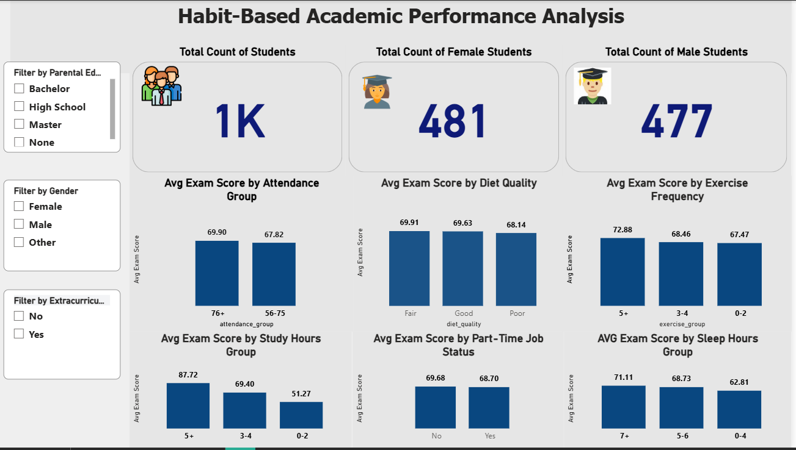

# 📊 Student Habits & Academic Performance Analysis

<p align="center">
  
  
  
  
  
  
</p>

<p align="center">
  <b>End-to-End Data Analysis Project</b><br>
  <i>From raw data to statistical validation to actionable insights & interactive dashboard</i>
</p>

---

## 📌 Overview

What truly drives student academic performance? This project investigates how daily lifestyle habits — study time, sleep, diet, exercise, social media usage, and mental health — relate to students' exam scores using a rigorous, statistics-driven approach.

The analysis follows a structured five-stage workflow:

**Data Quality Assessment → Univariate Profiling → Bivariate Analysis → Statistical Hypothesis Testing → Predictive Modeling**

All findings are validated with proper statistical tests (p-values, effect sizes) and summarized in an interactive Power BI dashboard designed for non-technical stakeholders.

> **Thesis Project** | 1,000 student records | 16 features | 9 statistical tests | Python EDA + Power BI Dashboard

---

## 🎯 Objective & Research Questions

- **Primary:** Which behavioral factors have a *statistically significant* impact on exam performance?
- **Secondary:** Can a small set of habit-based features reliably predict academic outcomes?
- **Stakeholders:** Students (behavior optimization), Educators (early-risk identification), Institutions (resource allocation)

---

## 🛠️ Tech Stack

| Category | Tools |
|----------|-------|
| **Data Wrangling** | Python, Pandas, NumPy |
| **Statistical Testing** | SciPy (Pearson, Spearman, Kruskal-Wallis, Mann-Whitney U) |
| **Visualization** | Matplotlib, Seaborn |
| **Predictive Modeling** | Scikit-Learn (Linear Regression, Pipeline, ColumnTransformer, OneHotEncoder) |
| **Dashboard** | Power BI (DAX measures, interactive slicers, conditional formatting) |
| **Environment** | Jupyter Notebook |

---

## 📁 Project Structure

```
student-habits-academic-performance-analysis/
├── EDA_Student_Habits_Performance.ipynb    # Full EDA + statistical tests + modeling
├── Student_Performance_Dashboard.pbix      # Power BI interactive dashboard
├── dashboard_preview.png                   # Dashboard screenshot
├── student_habits_performance.csv          # Raw dataset (1,000 x 16)
└── README.md                               # This file
```

---

## 📊 Dataset

| Property | Value |
|----------|-------|
| **Records** | 1,000 students |
| **Features** | 16 (6 numerical, 7 categorical, 1 identifier, 1 target, 1 engineered) |
| **Target Variable** | `exam_score` (continuous, 18.4 – 100.0) |
| **Missing Data** | `parental_education_level`: 91 values (9.1%) — imputed with mode |
| **Duplicates** | 0 |
| **Outliers** | 2 records in `exam_score` (retained — plausible boundary values) |
| **Gender Split** | Female: 481, Male: 477, Other: 42 |

### Feature Dictionary

| Feature | Type | Description | Range |
|---------|------|-------------|-------|
| `student_id` | string | Unique identifier | S1000–S1999 |
| `age` | int | Student age | 17 – 24 |
| `gender` | cat | Female / Male / Other | — |
| `study_hours_per_day` | float | Daily study hours | 0.0 – 8.3 |
| `attendance_percentage` | float | Class attendance % | 56.0 – 100.0 |
| `sleep_hours` | float | Average nightly sleep | 3.2 – 10.0 |
| `mental_health_rating` | int | Self-reported wellbeing | 1 – 10 |
| `exercise_frequency` | int | Exercise sessions/week | 0 – 6 |
| `social_media_hours` | float | Daily social media usage | 0.0 – 7.2 |
| `netflix_hours` | float | Daily streaming hours | 0.0 – 5.4 |
| `diet_quality` | cat | Poor / Fair / Good | — |
| `part_time_job` | cat | Yes / No | — |
| `parental_education_level` | cat | High School / Bachelor / Master | — |
| `internet_quality` | cat | Poor / Average / Good | — |
| `extracurricular_participation` | cat | Yes / No | — |
| `exam_score` | float | **Final exam score (TARGET)** | 18.4 – 100.0 |

---

## 🔬 Methodology

### 1. Data Quality Assessment
- Missing value analysis with count + percentage per feature
- Duplicate record detection (exact row matching)
- Outlier identification using **IQR method** (1.5× IQR threshold)
- Imputation strategy: **mode imputation** for `parental_education_level` (9.1% missing, 3 categories — mode was "High School" with 392 records)

### 2. Univariate Profiling
- Distribution plots (histograms + KDE) for all 9 numerical features
- Frequency tables with count + percentage annotations for all 7 categorical features
- Descriptive statistics with gradient-styled summary table
- Skewness & kurtosis analysis to assess distribution characteristics

### 3. Bivariate Analysis
- **Pearson correlation** for continuous–continuous relationships (study hours, attendance, sleep, social media, Netflix vs. exam score)
- **Spearman rank correlation** for ordinal–continuous (mental health rating vs. exam score)
- **Scatter plots** with regression trend lines for top numerical predictors
- **Grouped bar charts** for categorical vs. exam score comparisons
- Full **correlation heatmap** with annotated coefficient values

### 4. Statistical Hypothesis Testing

Nine hypothesis tests were conducted to determine which factors have a *statistically significant* effect on exam scores. Test selection was based on data types and group counts:

| Feature | Test Applied | Groups | Rationale |
|---------|-------------|--------|-----------|
| `gender` | Kruskal-Wallis H | Female / Male / Other | Non-parametric, >2 independent groups |
| `diet_quality` | Kruskal-Wallis H | Poor / Fair / Good | Ordinal categories, non-normal distribution |
| `exercise_frequency` | Kruskal-Wallis H | 0-2 / 3-4 / 5+ times/week | Binned numerical, 3 groups |
| `parental_education_level` | Kruskal-Wallis H | HS / Bachelor / Master | Categorical, >2 groups |
| `internet_quality` | Kruskal-Wallis H | Poor / Average / Good | Categorical, >2 groups |
| `part_time_job` | Mann-Whitney U | Yes / No | Non-parametric, 2 independent groups |
| `extracurricular_participation` | Mann-Whitney U | Yes / No | Non-parametric, 2 independent groups |
| `mental_health_rating` | Spearman ρ | Ordinal 1–10 | Ordinal scale, monotonic relationship |
| `study_hours_per_day` | Pearson r | Continuous | Continuous, linear relationship |

**Significance threshold:** α = 0.05 (two-tailed)

### 5. Predictive Modeling (Baseline)

To validate bivariate findings and quantify explained variance:

- **Algorithm:** Linear Regression via sklearn Pipeline
- **Preprocessing:** `ColumnTransformer` — passthrough for numericals, `OneHotEncoder(drop='first')` for categoricals
- **Split:** 80/20 train-test (`random_state=42`)
- **Metrics:** R², MAE, baseline MAE (predicting mean) for comparison
- **Feature Importance:** Coefficient analysis with directional interpretation (positive/negative effect)

---

## 📈 Key Findings

### What Drives Exam Performance?

Only **3 out of 9** tested factors showed a statistically significant effect:

| Rank | Factor | Effect Size | Test | Statistic | p-value |
|------|--------|------------|------|-----------|---------|
| **1** | **Study hours per day** | Very strong positive | Pearson r | r = 0.83 | < 0.001 |
| **2** | **Mental health rating** | Moderate positive | Spearman ρ | ρ = 0.32 | < 0.001 |
| **3** | **Exercise frequency** | Small positive | Kruskal-Wallis H | H = 22.28 | < 0.001 |

**Practical impact:** Students studying 5+ hours/day score on average **~36 points higher** than those studying 0–2 hours (87.7 vs. 51.3). Students exercising 5+ times/week outperform sedentary peers by **~5 points**.

### What Does NOT Matter (p ≥ 0.05)

Despite common assumptions, the following factors showed **no statistically significant effect** on exam scores — challenging several popular beliefs about what drives student success:

| Feature | Test | p-value | Verdict |
|---------|------|---------|--------|
| Gender | Kruskal-Wallis H | 0.928 | Not significant |
| Part-time job status | Mann-Whitney U | 0.338 | Not significant |
| Diet quality | Kruskal-Wallis H | 0.292 | Not significant |
| Parental education level | Kruskal-Wallis H | 0.221 | Not significant |
| Internet quality | Kruskal-Wallis H | 0.200 | Not significant |
| Extracurricular participation | Mann-Whitney U | 0.922 | Not significant |

### Predictive Model

| Metric | Value | Interpretation |
|--------|-------|----------------|
| **R² (test set)** | 0.897 | 89.7% of exam score variance explained |
| **MAE (test set)** | 4.19 points | Average prediction error |
| **Baseline MAE** (predict mean) | 16.9 points | 75% error reduction vs. baseline |

> A simple Linear Regression model with habit-based features explains **~90% of the variance** in exam scores — confirming that academic performance is highly predictable from a small set of behavioral indicators.

---

## 📊 Dashboard Preview



The Power BI dashboard translates the EDA findings into an interactive stakeholder-facing tool:

- **3 KPI cards:** Total students (1,000), Female (481), Male (477)
- **Interactive slicers:** Gender, Parental Education Level, Extracurricular Participation
- **6 analytical views** (all column charts, consistent Y-axis 0–100):
  - Avg Exam Score by Attendance Group (76+ vs. 56–75)
  - Avg Exam Score by Diet Quality (Poor / Fair / Good)
  - Avg Exam Score by Exercise Frequency (0-2 / 3-4 / 5+ times/week)
  - Avg Exam Score by Study Hours Group (0-2 / 3-4 / 5+ hours) — strongest visual signal
  - Avg Exam Score by Part-Time Job Status (Yes / No)
  - Avg Exam Score by Sleep Hours Group (0-4 / 5-6 / 7+ hours)
- **Design:** Corporate Navy palette with sequential blue gradient for ordered categories
- **DAX measures:** Custom average calculations by behavioral group

---

## 💡 Recommendations

| Audience | Recommendation | Evidence Base |
|----------|---------------|---------------|
| **Students** | Prioritize consistent daily study time — the single highest-leverage behavior. Invest in mental wellbeing (sleep, stress management) as the second-most impactful factor. | r = 0.83 for study hours; ρ = 0.32 for mental health |
| **Educators** | Pair attendance monitoring with mental health check-ins to identify at-risk students. Attendance alone is a surprisingly weak predictor in this dataset. | Attendance correlation weak; mental health p < 0.001 |
| **Institutions** | Allocate resources toward mental health services — likely to yield higher academic returns than diet, internet, or extracurricular interventions (none of which showed significant effects). | 6/9 hypothesis tests non-significant |

---

## ⚠️ Limitations

1. **Cross-sectional & self-reported data:** Causal direction cannot be established. For example, does poor mental health cause low scores, or do low scores worsen mental health? Longitudinal data would be needed to answer this.

2. **Uniform marginal distributions:** All features exhibit near-zero skewness and negative kurtosis, suggesting the dataset may be partially synthetic. This could explain why some traditionally strong predictors (sleep, attendance) show weaker-than-expected correlations. Findings should be confirmed on real-world data before generalizing.

3. **Baseline model only:** The Linear Regression model captures linear relationships but may miss non-linear interactions (e.g., `study_hours × mental_health`). Tree-based models (Random Forest, XGBoost) could improve predictive performance.

---

## 🔮 Future Work

- Train **Random Forest / XGBoost** models and compare feature importance with Linear Regression coefficients
- Engineer **interaction features** (e.g., `study_hours × mental_health_rating`) to capture compounding effects
- Collect **longitudinal data** to establish causal relationships between habits and performance
- Deploy dashboard as a **web application** for real-time student monitoring
- Expand dataset with **real-world student records** to validate findings beyond synthetic distributions

---

## 🚀 Quick Start

### Prerequisites
```
python >= 3.9
```

### Installation
```bash
# Clone the repository
git clone https://github.com/senaerdemm2/student-habits-academic-performance-analysis.git
cd student-habits-academic-performance-analysis

# Install dependencies
pip install pandas numpy matplotlib seaborn scikit-learn scipy jupyter
```

### Run the EDA Notebook
```bash
jupyter notebook EDA_Student_Habits_Performance.ipynb
```

### Open the Dashboard
1. Download `Student_Performance_Dashboard.pbix`
2. Open with [Power BI Desktop](https://powerbi.microsoft.com/en-us/desktop/)

---

## 👩‍💻 Author

**Sena Erdem**
Data Analyst

<p align="center">
  <a href="https://www.linkedin.com/in/sena-erdem-a64b91345/">
    
  </a>
  <a href="https://github.com/senaerdemm2">
    
  </a>
</p>
